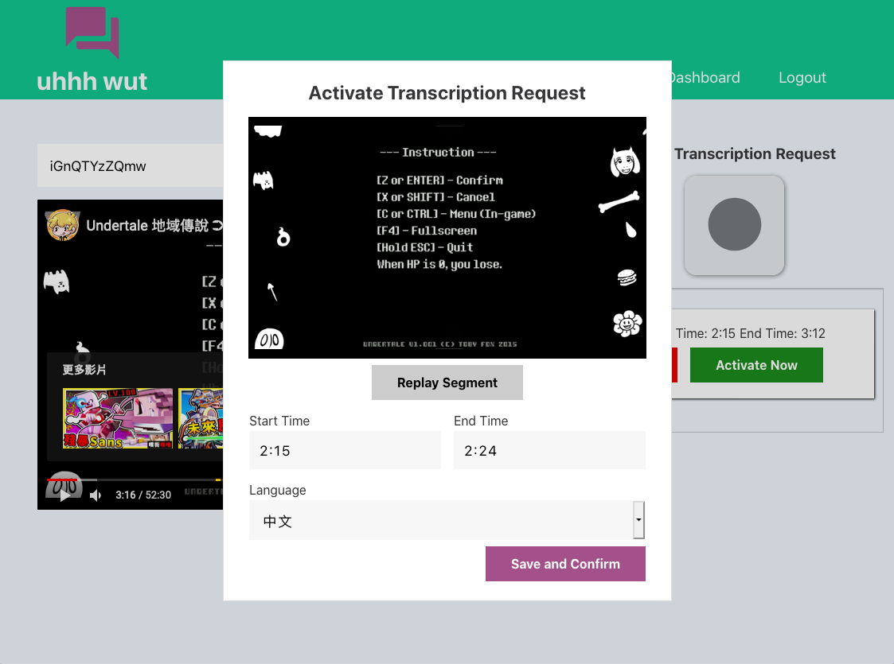

# [uhhhwut](https://uhhhwut.onrender.com/ "Unselfish Humans Helping Humans With Unlimited Transcriptions")

> Unselfish Humans Helping Humans With Unlimited Transcriptions

## The Concept

uhhhwut is a single-page web application that crowdsources transcriptions of YouTube videos, and is targeted at learners of foreign languages who watch YouTube videos to immerse in their target language.  

### Example

For instance, if I am an English speaker studying Japanese, and while watching a Japanese YouTube video I encounter some segment of the video I did not understand, I can create a **transcription request** for that segment of the video, and later on, a Japanese user of the site will transcribe that segment of the video for me. The catch, however, is that to actually enact this request I must first transcribe another user's transcription request for an English video!

## Features

* Embedded YouTube player so that users can easily watch videos within the app.
* Transcription Request creation and activation process that is intuitive, easy-to-use, and minimally disruptive to the user's immersion in their video of choice.
* Responsive design so that the site remains not only functional, but also a joy to use regardless of the user's screen size.
* Internationalization! The app is all set up and ready to be translated into any language spoken on this Earth! There is already a full translation set for Chinese set up in the app (albeit surely with wild grammatical and vocabulary inaccuracies since I, a very much non-fluent Chinese speaker, made it).
    * The app makes its choice on what locale the user is in based on the user's primary browser language. To see the Chinese version of the site, you must change your browser's language to Chinese!

## Can I check it out?

Okay, sure. [It's deployed here!](https://uhhhwut.onrender.com/)

## Screenshots

|  |
| :---: |
| Watching a video |

|  |
| :---: |
| Creating a transcription request |

|  |
| :---: |
| Confirming a transcription request |

|  |
| :---: |
| Transcribing another user's request |

|  |
| :---: |
| The transcription request dashboard |

Click to see the same screenshots as above, but in the Chinese internationalized view!

|  |
| :---: |
| Watching a video 

|  |
| :---: |
| Creating a transcription request |

|  |
| :---: |
| Confirming a transcription request |

|  |
| :---: |
| Transcribing another user's request |

|  |
| :---: |
| The transcription request dashboard |

## A guided workflow, if it so interests you

1. Register a new account. **Do not use any sensitive credentials. This is not a secure application!** 
    * The deployed version actually disables and pre-fills all password fields to the string 'password'... sooo basically just don't manually re-enable these fields in dev tools and then change their value 😅
1. Decide which YouTube video you want to watch in the workshop, then copy and paste its URL into the search bar.
1. Start watching the video.
1. Click the large "Record" button when you encounter the start of a segment you would like to request transcription for. Click the large "Stop" button when the player hits the end of the segment you want transcribed.
1. Click the "Activate" button on the transcription request you have just created, which should appear to the right of the player.
1. Go through the activation process! Feel free to double-check that the segment presented to you in step one of the activation process is indeed what you requested, and specify the language of this segment, then "Save and Confirm".
1. If there is an untranscribed request in your native language, you will now see it presented to you in step two of the activation process. Play the video and transcribe it to help out another user and activate your request!
    * And if there isn't an untranscribed request in your native language, you are free to activate your request right away!
1. When another user eventually transcribes the request you just activated, it will appear at the top of your dashboard, in a list titled "New Transcriptions".

## Technologies Used

This application was built using the [React](https://github.com/) JavaScript library, and was bootstrapped with [create-react-app](https://github.com/facebook/create-react-app). The only packages used in the production site outside of those provided by create-react-app are [react-youtube](https://www.npmjs.com/package/react-youtube), [react-intl](https://www.npmjs.com/package/react-intl), and [react-router-dom](https://www.npmjs.com/package/react-router-dom).  

A couple additional Babel-related packages were used as development dependencies, all of which were used in conjunction for the process of extracting the messages marked for internationalization throughout the source code.  

The API server is powered by [json-server](https://www.npmjs.com/package/json-server).  

All styling was accomplished with vanilla CSS3 written by me.

## Planning Resources

Below are the planning documents and resources I created before I began implementing this project. These resources all proved to be invaluable during development as they constantly gave me a roadmap of what needed to happen and in what order, and the completed project did not wind up straying far from any of these plans.

* [ERD](https://dbdiagram.io/d/5f597e0d88d052352cb69c4e)
* [Figma Wireframe](https://www.figma.com/file/D3tHMbdYUBncNy8yKm5ZWV/Front-End-Capstone?node-id=0%3A1)
* [React Component Planning and Specification](https://drive.google.com/file/d/1AhZ4Q1Usssi593gdG7K-x0rGvAuPzbhs/view?usp=sharing)

## Author

Jacob Eckert - [GitHub](https://github.com/skratz17), [LinkedIn](https://www.linkedin.com/in/jacob-w-eckert/) 
